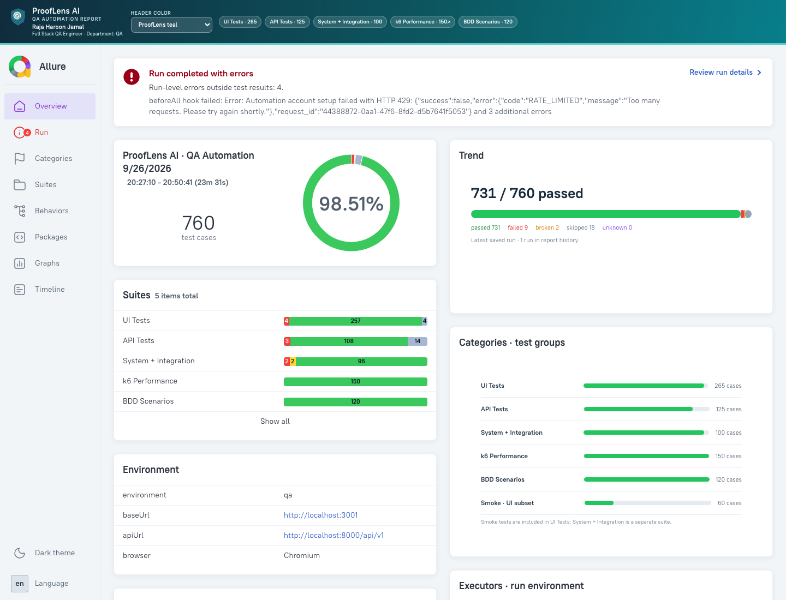
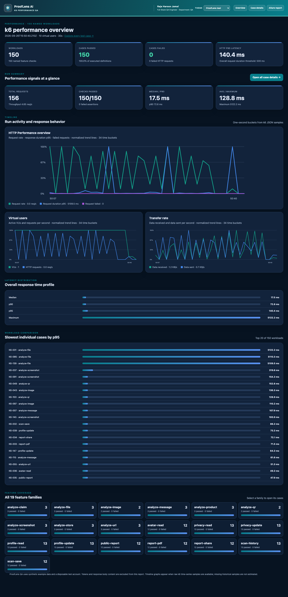
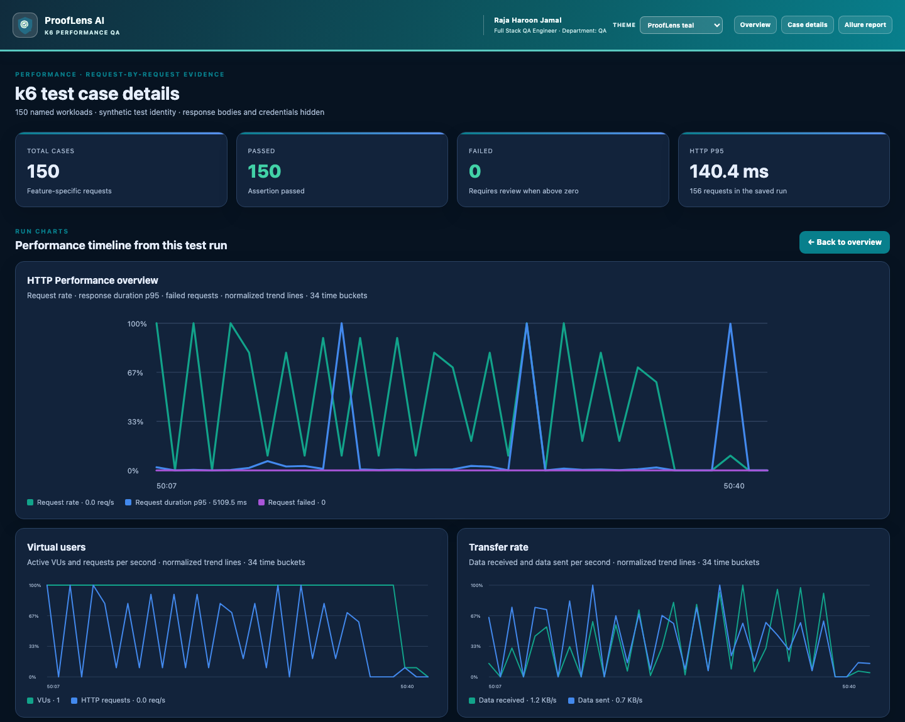
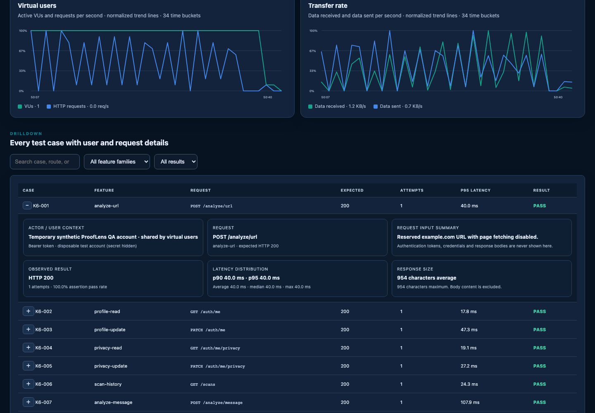

<p align="center">
  
</p>

# ProofLens AI — Web and API

**Check Before You Trust.** ProofLens helps people inspect suspicious links, files, images, claims, and messages using explainable signals and evidence.

### Latest Allure report overview

Freshly generated from the latest 760-case QA run. The report includes the run summary, suite breakdown, category groups, and trend overview.



This is the web project branch (`main`). It contains the Next.js web app, FastAPI backend, browser extension, and shared documentation. The standalone Expo/React Native application, with its own root README, is kept on the `mobile-app` branch.

## Web app features

- Public marketing homepage with quick-check entry points, a four-step product explanation, FAQ, and clear privacy notes.
- Account registration, sign-in, password reset, profile/password settings, and selectable themes.
- An authenticated workspace with real-data safety metrics, analyzer, scan history, reports, saved checks, Help, Privacy, and account settings.
- Checks for URLs, messages, screenshots, QR codes, images, files, stores, products, and claims.
- A Threat Center with practical scam-prevention guides. This is educational content, not a live threat feed.
- Optional local AI explanations through Ollama. AI advice is identified separately and does not set evidence or risk scores.
- A browser extension for Chrome, Edge, and Firefox that hands a user-selected page, link, or text to the web workspace.
- Fictional, read-only sample reports through **Explore sample workspace** on the sign-in screen.

## Application structure

The repository separates the user-facing clients, API, and quality tooling. The web client calls the versioned FastAPI service; the service validates requests, runs analyzers, stores scan evidence, and returns structured reports. Provider integrations are optional and are isolated behind backend adapters.

```text
ProofLensAI/
├── apps/
│   ├── web/                 Next.js App Router product and report pages
│   │   ├── app/             Routes, including shared proof reports and password reset
│   │   ├── e2e/             Playwright suites, BDD features, fixtures, and test assets
│   │   ├── performance/k6/  Authenticated K6 workload matrix
│   │   ├── scripts/         QA orchestration, Allure import/branding, report builders
│   │   └── public/          Product assets and report screenshots
│   └── extension/           Chrome/Edge and Firefox manifests and packaging scripts
├── backend/
│   ├── app/api/             Versioned FastAPI routes
│   ├── app/analyzers/       Deterministic URL, message, file, image, and claim checks
│   ├── app/providers/       Optional external and local service adapters
│   ├── app/services/        Scan orchestration, evidence, reports, and auth logic
│   ├── app/db/              Database setup and persistence
│   ├── app/models/          API and database models
│   ├── migrations/          Alembic schema migrations
│   └── tests/               Backend unit and integration coverage
├── docs/                    Architecture, API, security, risk engine, integrations
├── scripts/                 Repository-level automation helpers
├── package.json             Workspace and root developer/QA commands
└── README.md                Setup, architecture, QA, and report entry point
```

At runtime, the web app and browser extension use the FastAPI `/api/v1` endpoints. API services validate each request, call local analyzers and configured provider adapters, then persist results through the database layer. During QA, Playwright UI/API/system suites, generated BDD scenarios, and K6 workloads feed Allure and the overview/detail report builders. The standalone Expo mobile app is maintained on the `mobile-app` branch.

## QA automation and reports

The complete QA profile is designed to execute **760 named cases**:

| Suite | Cases | Coverage |
| --- | ---: | --- |
| UI | 265 | Smoke, regression, all nine live analyzer modes, account and avatar settings, report lifecycle, themes, and navigation |
| API | 125 | Authentication, mobile token rotation, password recovery, access control, profiles, avatars, analyzer validation, history, sharing, and exports |
| BDD | 120 | Real Gherkin `Scenario Outline` examples run through Playwright via `playwright-bdd` |
| k6 | 150 | Authenticated feature traffic across account, privacy, mobile sessions, all analyzer endpoints, history, reports, and avatars; 10 VUs for the configured duration |
| System + integration | 100 | Five themes × ten viewports × landing/sample workspaces, with API health and layout assertions |

The test data uses Faker generated identities and `.example` email addresses. API created QA users and their scans are removed in suite teardown. Safe local fixtures are in `apps/web/e2e/assets/`; no live phishing or malware sample is included. Screenshots and videos are captured for browser suites, and Playwright traces are kept for failures. k6 creates one disposable ProofLens account, exercises authenticated endpoints and removes its account and generated scan data in teardown; its 150 named cases are imported into the same Allure run with request results attached.

### Start and run QA

Use Node 24.6 (`nvm use` at the repository root), install npm dependencies, and start the local API in test mode so loopback QA workers share the higher test-only rate limits. From `backend`, run `APP_ENV=test uvicorn app.main:app --reload`. The Playwright config starts the web app at port 3001 if it is not already running. Copy the QA environment template only if you want local overrides:

```sh
cp apps/web/.env.qa.example apps/web/.env.qa
```

The checked-in template contains local QA URLs and performance settings only; do not put provider keys or production credentials in it. It defaults to a 10 VU, 30-second K6 smoke profile. Run the complete 760-case session from the repository root:

```sh
npm run test:qa
```

Docker Desktop must be running and able to use the `grafana/k6:1.6.1` image. The API must be reachable at the QA URL. The runner performs this sequence:

1. Generates the 120 Gherkin scenario examples from `apps/web/e2e/features/`.
2. Runs the 610 Playwright UI, API, BDD, and system/integration cases. Browser failures keep their screenshots, videos, traces, and Allure result attachments.
3. Runs the 150 authenticated K6 cases against the local test API using a temporary account and synthetic `.example` data; teardown deletes the account and generated scan data.
4. Imports one Allure result per K6 case, including an individual JSON result attachment. The K6 case view includes expected/observed HTTP status, attempt count, assertion pass rate, per-case latency distribution, and response character-count averages/maxima. Response bodies are intentionally excluded.
5. Exports raw k6 JSON time-series samples, applies category grouping, generates the full Allure report, and builds the ProofLens suite, trend, K6 overview, and searchable K6 case reports.

The K6 overview has a dark, high-contrast dashboard below the shared branded header. It includes run KPIs, latency distribution, per-feature workload coverage, slowest workloads, and native-style time-series graphs for HTTP request rate/latency/failures, virtual users/request activity, and received/sent transfer rates. The same run graphs also appear above the case list on the K6 detail page. Raw time-series are exported to the ignored `apps/web/reports/k6-timeseries.json`; older saved runs without this file show an explicit “not captured” state. Each K6 case expands to show its synthetic actor/authentication context, method and route, safe request-input summary, expected and observed status, attempts, assertion pass rate, latency distribution, response-size measurements, and result. Tokens, passwords, and response bodies are not displayed. Search and family/result filters help locate cases.

### Latest report pages

The screenshots below are captured from the current generated reports. They are also served as static web assets from `apps/web/public/report-screenshots/`.

**K6 performance overview — dark dashboard, metrics, timelines, workload latency, and feature coverage**



**K6 run graphs — actual request, VU, and transfer timelines from the latest 30-second run**



**Expanded K6 case — synthetic actor, safe request summary, expected/observed status, timings, and result**



The latest K6 run reports 150/150 cases and checks passed, 156 requests, 4.65 requests/second, 10 virtual users over 30 seconds, 17.5 ms median latency, 72.6 ms p90, 140.4 ms p95, 128.8 ms average, and 5,122.2 ms maximum. Its raw timeline is rendered in the HTTP performance, VUs/request, and transfer-rate charts on both K6 pages. The overall QA run passed 731/760 cases; the remaining API/signup and two viewport failures are recorded in Allure and Playwright artifacts, including rate-limit responses.

Allure suite totals are UI 265, K6 150, API 125, BDD 120, and System + Integration 100. The generated local reports are `apps/web/reports/allure-report/index.html` (full Allure), `apps/web/reports/k6-report.html` (K6 overview), and `apps/web/reports/k6-cases-report.html` (case list). These report outputs are generated locally and are not committed; rebuild them with the QA commands below.

Run an individual suite from the repository root with `npm run test:ui`, `npm run test:api`, `npm run test:bdd`, `npm run test:system`, or `npm run test:k6`. K6's 10 VU, 30-second default is a local performance smoke profile; its thresholds are not a production capacity certification. Override the VU count and duration in the ignored `apps/web/.env.qa` file for a deliberately sized QA run.

## Requirements

- Node.js 22.13+ or 24.3+
- Python 3.11+
- SQLite for the simplest local setup, or PostgreSQL 14+

## Start the project locally

### 1. Configure the backend

Copy `.env.example` to `.env`. Set a strong `JWT_SECRET`; configure `DATABASE_URL` when using PostgreSQL. SQLite is available for local development.

```sh
cd backend
python -m venv .venv
source .venv/bin/activate
pip install -r requirements.txt
alembic upgrade head
uvicorn app.main:app --reload
```

The API runs at http://localhost:8000 and its Swagger UI is at http://localhost:8000/docs.

### 2. Install and start the web app

From the repository root:

```sh
nvm use
npm install
npm run dev:web
```

Open http://localhost:3001. You can register/sign in for live API checks, or choose **Explore sample workspace** for fictional read-only example reports. A live scan requires a running API.

## Browser extension (Phase 3)

**Phase 3 implementation is complete:** the extension supports current-page checks, selected links and text, and opens the existing ProofLens web flow/API after the user reviews and submits the handoff. Chrome/Edge and Firefox packages build locally. Public store submission is a release task and still needs publisher accounts and store review.

Build both browser packages from the repository root:

```sh
npm run build:extension
```

Load `apps/extension/dist/chrome/` as an unpacked extension in Chrome or Edge. In Firefox 140+, load `apps/extension/dist/firefox/manifest.json` from `about:debugging`. Use the toolbar popup for the current page or selected text, or the context menu for pages, links, and selections. The extension opens the web app; sign in, review the content, then choose **Analyze safely** to run the shared API flow. See [`apps/extension/README.md`](apps/extension/README.md) for permissions, data flow, and detailed setup.

## API, integrations, and project docs

The API provides session authentication, scan endpoints, history, private report sharing, and report export. SQLite is the simplest development database; PostgreSQL is supported for deployment. Optional integrations such as ClamAV, YARA, Google Web Risk, fact checks, and media analysis are documented in [`docs/phase2-integrations.md`](docs/phase2-integrations.md). Provider credentials and local services are not needed for the sample workspace.

- [`docs/architecture.md`](docs/architecture.md) — service and app layout.
- [`docs/api.md`](docs/api.md) — API routes and request/response conventions.
- [`docs/risk-engine.md`](docs/risk-engine.md) — evidence and risk scoring.
- [`docs/security.md`](docs/security.md) — security model and data handling.
- [`apps/extension/README.md`](apps/extension/README.md) — browser package setup.

## Completion status and deployment-dependent work

- **Scan-retention controls:** implemented in Account & Settings → Privacy. Choose 30, 90, 180, or 365 days, or keep scans until you delete them. Expired scans and their evidence are cleaned up daily by each API deployment. Apply the database migration with `cd backend && alembic upgrade head` before deploying this change.
- **Live/community threat alerts and administrator console:** not implemented. The Threat Center currently contains safety guides only; it must not be presented as a live threat feed.
- **Audio/video checks:** not implemented. The configured media adapter currently applies to supported image checks; audio/video requires a separate provider and an explicit upload, privacy, and result contract.
- **Social sign-in:** not implemented. Google/Apple OAuth needs registered client credentials, callback URLs, and provider review/configuration.
- **Push/email notifications:** not implemented beyond password-reset email. Push delivery requires platform credentials and user opt-in; email alerts require SMTP configuration and notification preferences.
- **Browser-store publication:** extension builds are available for review, but publication requires store-owner accounts, listing assets, privacy disclosures, and store approval. Build locally with `npm run build:extension`.

These deployment and provider items are not claimed as complete by the local application. See [`docs/phase2-integrations.md`](docs/phase2-integrations.md) for provider setup and limitations.

## Developer commands

```sh
npm run lint
npm run build:web
npm run build:extension
npm run test:backend
```

Browser/API end-to-end checks are available after starting the backend: install Playwright Chromium with `npx playwright install chromium`, then run `npm run test:e2e`.

## Data and limitations

Submitted scan content is stored with its report in the configured database. Optional external providers receive the data needed for the enabled check; review provider terms and data handling before configuring them. Private shared reports omit the original submitted content. Sample reports are fictional and read-only. A low-risk result is not a safety guarantee, and a score is not a probability.
